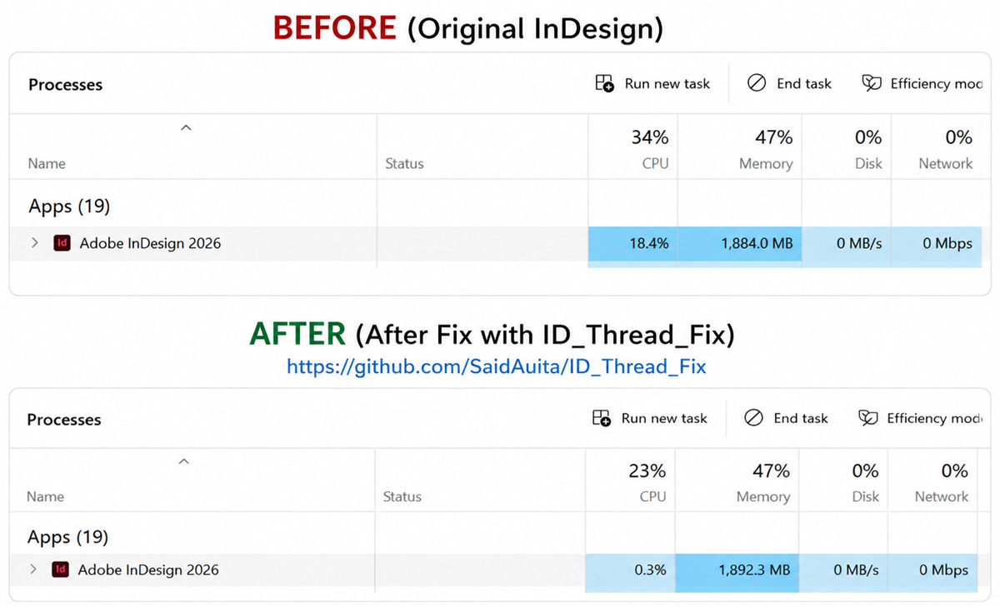
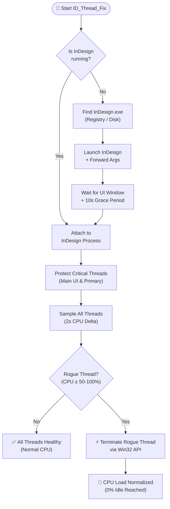
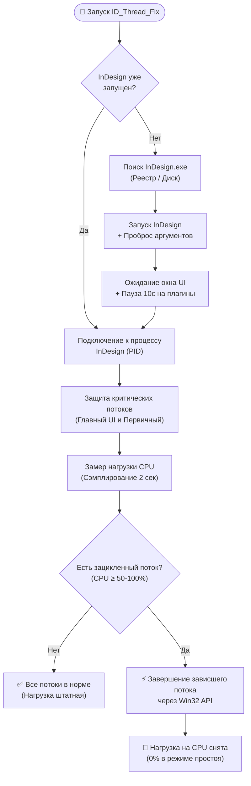

# InDesign Thread Fix (ID_Thread_Fix)

<div align="center">



<br/><br/>

**Safe and lightweight CPU 100% thread fix utility and launcher for Adobe InDesign (2020 – 2026+)**

[](https://github.com/SaidAuita/ID_Thread_Fix/releases/latest/download/ID_Thread_Fix.exe)
[](dist/ID_Thread_Fix.exe?raw=true)

<br/>

[](https://github.com/SaidAuita/ID_Thread_Fix/releases)
[](https://opensource.org/licenses/MIT)
[](https://microsoft.com/windows)
[](https://www.adobe.com/products/indesign.html)
[](https://dotnet.microsoft.com/)

*( 🇬🇧 [English](#english) | 🇷🇺 [Русский](#русский) )*

</div>

---

<a id="english"></a>
## 🇬🇧 English

### Overview

**InDesign Thread Fix (ID_Thread_Fix)** is a specialized, lightweight Windows utility that resolves the infamous high-CPU bug in **Adobe InDesign** (versions CC 2020 through 2026+), where runaway background worker threads get stuck in 100% CPU infinite loops.

This bug commonly occurs due to stalled CEP extension panels, Creative Cloud library synchronizers, or font caching routines. The symptom is unmistakable: even when InDesign is completely idle, one or more CPU cores stay pegged at 100%, causing laptop fans to spin at maximum speed, battery drain, thermal throttling, and subtle UI stuttering.

`ID_Thread_Fix` monitors, isolates, and terminates **only** the runaway background threads while protecting the main UI thread and primary process thread.

---

### 📥 Download Prebuilt Executable

* **[Download latest ID_Thread_Fix.exe (GitHub Release)](https://github.com/SaidAuita/ID_Thread_Fix/releases/latest/download/ID_Thread_Fix.exe)**
* **[Direct Download from Repository (`dist/ID_Thread_Fix.exe`)](dist/ID_Thread_Fix.exe?raw=true)**

*No installation required. Single portable `.exe` file (~100 KB).*

---

### Key Features

* **🛡️ Protects Main UI & Primary Process Threads**: The utility deliberately excludes InDesign's main UI thread (`MainWindowHandle`) and primary process thread (`Threads[0]`) from termination.
* **🔬 Accurate Differential CPU Sampling**: Uses a 2-second sampling window to measure exact processor time deltas. Only threads consuming $\ge 50\text{--}100\%$ of a full CPU core during idle are flagged as rogue.
* **🚀 Universal Launcher Wrapper**: Acts as a drop-in launcher for InDesign. It forwards all command-line arguments, document paths (`.indd`), and automations, waits for InDesign to start up, and automatically cleans up background threads.
* **⚡ One-Shot Fix Mode (`--fix-only`)**: Instantly attaches to already-running InDesign instances and kills runaway threads without restarting.
* **🔄 Background Daemon Mode (`--monitor`)**: Can run in the background (e.g., in Task Scheduler or startup) to periodically clean up runaway threads every $N$ minutes.
* **🪶 Zero Dependencies & Portable**: Tiny standalone `.exe` (~100 KB) with native .NET Framework support built into every Windows 10/11 system. No installer or runtime setup required.
* **🔎 Multi-Version Auto-Detection**: Automatically searches Windows Registry and standard Adobe directories for InDesign CC 2020, 2021, 2022, 2023, 2024, 2025, 2026+.

---

### How It Works



---

### Usage

#### 1. Direct Launcher (Recommended)
Replace your desktop or taskbar shortcut with `ID_Thread_Fix.exe`. When clicked, it will start InDesign, pass any opened `.indd` files, and automatically normalize CPU usage after startup:
```cmd
ID_Thread_Fix.exe "C:\Projects\AnnualReport.indd"
```

#### 2. Fix Currently Running InDesign
If InDesign is already open and your CPU fan is spinning:
```cmd
ID_Thread_Fix.exe --fix-only
```

#### 3. Continuous Background Monitor
Run as a lightweight monitor every 10 minutes:
```cmd
ID_Thread_Fix.exe --monitor 10 --log "C:\Logs\indesign_fix.log"
```

---

### Command-Line Arguments

| Option | Short | Description |
| :--- | :---: | :--- |
| `--fix-only` | `-f` | Scan and fix running InDesign instances without launching InDesign if closed. |
| `--monitor [min]` | `-m` | Run as continuous background daemon checking every `[min]` minutes (default: 5). |
| `--verbose` | `-v` | Display detailed diagnostic information and thread metrics. |
| `--silent` | `-s` | Run in silent mode without console output. |
| `--log <path>` | | Append timestamped logs to the specified text file. |
| `--help` | `-h` | Show help message with all available options. |
| `--version` | | Show program version. |

---

### Building from Source

You can build `ID_Thread_Fix` in two ways:

#### Option A: Quick Build (Native Windows .NET Framework)
No SDKs required! Runs using the built-in Windows C# compiler:
```cmd
build.bat
```

#### Option B: .NET SDK Build
```cmd
dotnet build -c Release
```
The resulting executable will be placed in the `dist/` directory.

---

### Compatibility

* **OS**: Windows 10, Windows 11, Windows 8.1, Windows 7 (x64 / x86 / ARM64).
* **Adobe InDesign**: CC 2019, 2020, 2021, 2022, 2023, 2024, 2025, 2026+.

## 🛠️ Other Projects

**[Free Adobe Automation Tools](https://ph-cu-s.com/tools)**
* Collection of free scripts and automation tools for Adobe Creative Cloud applications.

**[AI Dimension](https://github.com/SaidAuita/AI-Dimension)**
* Advanced technical dimensioning, bounds, and leader line extension panel for Adobe Illustrator.

**[ID Dimension](https://github.com/SaidAuita/ID-Dimension)**
* Professional technical dimensioning script and palette for Adobe InDesign.

**[ComfyUI Photoshop Plugin (PH-CU-S)](https://github.com/SaidAuita/ComfyUI_PH-CU-S)**
* A powerful Photoshop plugin powered by ComfyUI, providing direct integration with local generative models.

---

<a id="русский"></a>
## 🇷🇺 Русский

### Описание

**InDesign Thread Fix (ID_Thread_Fix)** — специализированная утилита для Windows, устраняющая известную проблему высокой загрузки процессора в **Adobe InDesign** (версий 2020–2026+), при которой фоновые потоки зацикливаются и загружают ядро CPU на 100%.

Эта проблема часто возникает из-за зависших фоновых процессов расширений CEP, синхронизации библиотек Creative Cloud или построения кэша шрифтов. Симптом очевиден: даже в режиме полного простоя InDesign одно или несколько ядер процессора загружены на 100%, кулеры ноутбука/ПК работают на максимуме, батарея быстро разряжается, а интерфейс начинает подтормаживать.

`ID_Thread_Fix` находит, изолирует и завершает **только** зацикленные фоновые потоки, целенаправленно исключая из завершения главный UI-поток и первичный процесс InDesign.

---

### 📥 Скачать готовый файл

* **[Скачать релиз ID_Thread_Fix.exe (GitHub Releases)](https://github.com/SaidAuita/ID_Thread_Fix/releases/latest/download/ID_Thread_Fix.exe)**
* **[Прямое скачивание из репозитория (`dist/ID_Thread_Fix.exe`)](dist/ID_Thread_Fix.exe?raw=true)**

*Не требует установки. Один портативный файл `.exe` (~100 КБ).*

---

### Основные возможности

* **🛡️ Защита главного UI и первичного процесса**: Утилита целенаправленно исключает из завершения главный поток интерфейса (`MainWindowHandle`) и первичный поток процесса (`Threads[0]`).
* **🔬 Точный замер CPU (сэмплирование)**: Измеряет дельту процессорного времени за 2-секундный интервал. Зацикленными считаются только потоки, непрерывно потребляющие $\ge 50\text{--}100\%$ ядра в режиме простоя.
* **🚀 Универсальный лаунчер**: Может использоваться вместо стандартного ярлыка InDesign. Корректно пробрасывает все аргументы командной строки и открываемые файлы `.indd`, дожидается запуска программы и автоматически нормализует загрузку процессора.
* **⚡ Мгновенный фикс (`--fix-only`)**: Мгновенно подключается к уже запущенному InDesign и завершает зависшие потоки без перезапуска программы.
* **🔄 Режим фонового мониторинга (`--monitor`)**: Может работать в фоне (или запускаться через планировщик задач) и автоматически проверять потоки каждые $N$ минут.
* **🪶 Без зависимостей и установки**: Легковесный бинарник (~100 КБ), работающий на любой Windows 10/11 без установки дополнительного ПО.
* **🔎 Автопоиск версий InDesign**: Автоматически находит установленный InDesign через реестр Windows и стандартные пути для версий CC 2020–2026+.

---

### Схема работы



---

### Варианты использования

#### 1. Запуск вместо ярлыка InDesign (Рекомендуется)
Замените ярлык InDesign на рабочем столе или панели задач на `ID_Thread_Fix.exe`. При запуске утилита откроет InDesign (включая переданные `.indd` файлы) и сразу после старта устранит зависшие потоки:
```cmd
ID_Thread_Fix.exe "C:\Projects\Brochure.indd"
```

#### 2. Быстрое исправление уже запущенного InDesign
Если InDesign уже открыт и сильно шумит кулер:
```cmd
ID_Thread_Fix.exe --fix-only
```

#### 3. Мониторинг в фоновом режиме
Периодическая проверка каждые 10 минут с записью логов:
```cmd
ID_Thread_Fix.exe --monitor 10 --log "C:\Logs\indesign_fix.log"
```

---

### Параметры командной строки

| Опция | Сокращение | Описание |
| :--- | :---: | :--- |
| `--fix-only` | `-f` | Сканировать и исправить запущенный InDesign без его открытия, если он закрыт. |
| `--monitor [мин]` | `-m` | Работать как фоновый демон с интервалом проверки `[мин]` минут (по умолчанию: 5). |
| `--verbose` | `-v` | Выводить подробную диагностику и метрики потоков. |
| `--silent` | `-s` | Тихий режим работы без вывода в консоль. |
| `--log <путь>` | | Записывать логи с временными метками в указанный файл. |
| `--help` | `-h` | Показать справку по всем доступным командам. |
| `--version` | | Показать версию программы. |

---

### Сборка из исходников

#### Вариант 1: Быстрая сборка (Встроенный компилятор Windows)
Не требует установки SDK, собирается за 0.2 секунды:
```cmd
build.bat
```

#### Вариант 2: Сборка через .NET SDK
```cmd
dotnet build -c Release
```
Готовый исполняемый файл будет помещен в папку `dist/`.

## 🛠️ Мои проекты

**[Free Adobe Automation Tools](https://ph-cu-s.com/tools)**
* Каталог бесплатных скриптов и инструментов автоматизации для программ Adobe.

**[AI Dimension](https://github.com/SaidAuita/AI-Dimension)**
* Аналогичное расширение для простановки размеров и выносок в Adobe Illustrator.

**[ID Dimension](https://github.com/SaidAuita/ID-Dimension)**
* Профессиональный инструмент и палитра для простановки размеров в Adobe InDesign.

**[ComfyUI Photoshop Plugin (PH-CU-S)](https://github.com/SaidAuita/ComfyUI_PH-CU-S)**
* Мощный плагин для Photoshop на базе ComfyUI, обеспечивающий прямую интеграцию с локальными генеративными моделями.

---

### Лицензия

Проект распространяется под открытой лицензией [MIT](LICENSE).
Copyright © 2026 [SaidAuita](https://github.com/SaidAuita).
